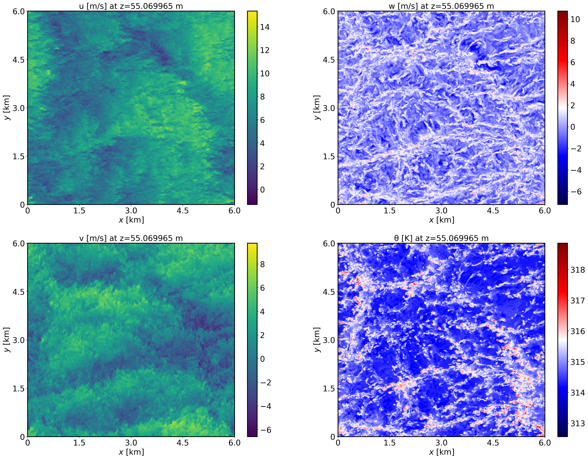
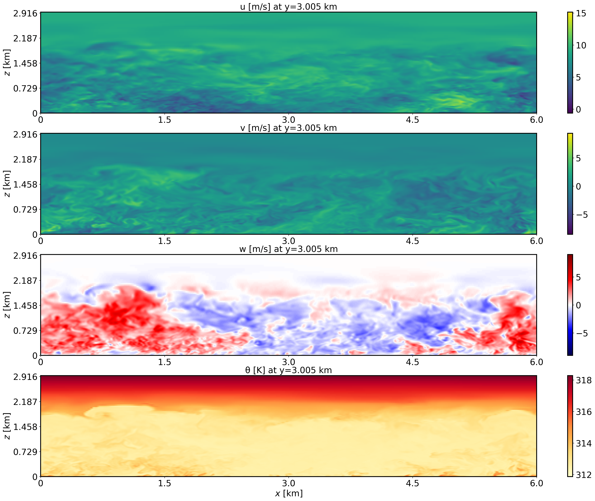
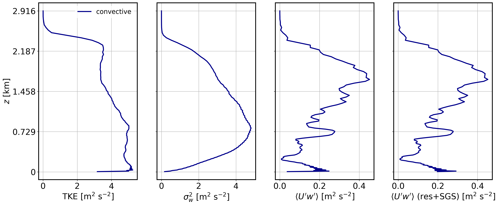

Dry convective boundary layer
================================

This is the convective boundary layer scenario described by Sauer and Munoz-Esparza (2020). This case represents the boundary layer conditions at the SWiFT facility near Lubbock, Texas at 4 July 2012 during the period of 18Z-20Z (12:00–14:00 local time), the strongest period of convection on the day.

Input parameters
----------------

* Number of grid points: :math:`[N_x,N_y,N_z]=[600,600,122]`
* Isotropic grid spacings: :math:`[dx,dy,dz]=[10,10,10]` m
* Domain size: :math:`[6 \times 6 \times 2.9]` km
* Model time step: 0.02 s
* Geostrophic wind: :math:`[U_g,V_g]=[8,0]` m/s
* Advection scheme: Hybrid 5th-6th order, blending coefficient of 0.8
* Time scheme: 3rd order Runge Kutta
* Latitude: :math:`33.5^{\circ}` N
* Surface potential temperature: :math:`309` K
* Potential temperature profile:
.. math::
  \partial{\theta}/\partial z =
    \begin{cases}
      0 & \text{if $z$ $\le$ 500 m}\\
      0.004 & \text{if $z$ > 500 m}
    \end{cases}
* Surface heat flux:  :math:`0.35` Km/s
* Surface roughness length: :math:`z_0=0.05` m
* Rayleigh damping layer: uppermost :math:`600` m of the domain
* Cell perturbations: :math:`\pm 0.25` K 
* Top boundary condition: free slip
* Lateral boundary conditions: periodic
* Time period: 6 h

Execute FastEddy
----------------

Here we will describe how to download the FastEddy package and run the model. The package will include the executables, a script to install the executables in a directory structure, and other files such as the Jupyter notebooks.

Visualize the output
--------------------

Open the Jupyter notebook entitled "FE-TUTORIAL-analyses.ipynb" and execute it. Please ensure you create the plots exactly as shown below.

XY-plane views of instantaneous velocity components at t=6 h (FE_TEST.1080000):

  
XZ-plane views of instantaneous velocity components at t=6 h (FE_TEST.1080000):

  
Mean state variable profiles at t=6 h (FE_TEST.1080000) (domain horizontal average):

.. image:: ../images/MEAN-PROF-convective.png
  :width: 600
  :alt: Alternative text
  
Mean turbulence profiles at t=6 h (FE_TEST.1080000) (using previous 1-hour mean):

Analyze the output
------------------

* Using the XY and XZ cross sections, discuss the characteristics of the resolved turbulence.
* What is the boundary layer height in the convective case?
* Using the vertical profile plots, explain why the boundary layer is unstable.
* Other...
