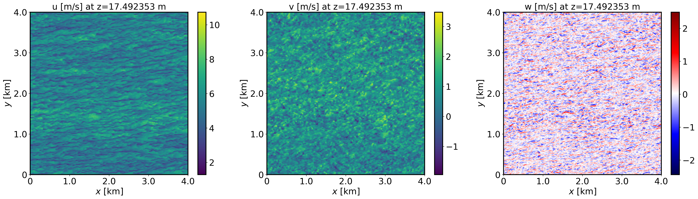
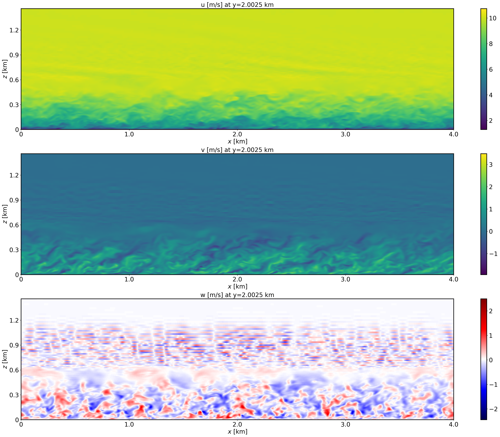
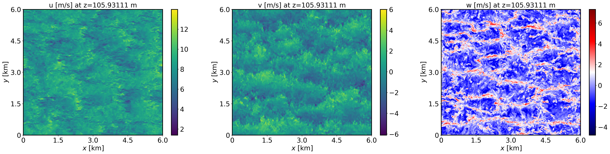
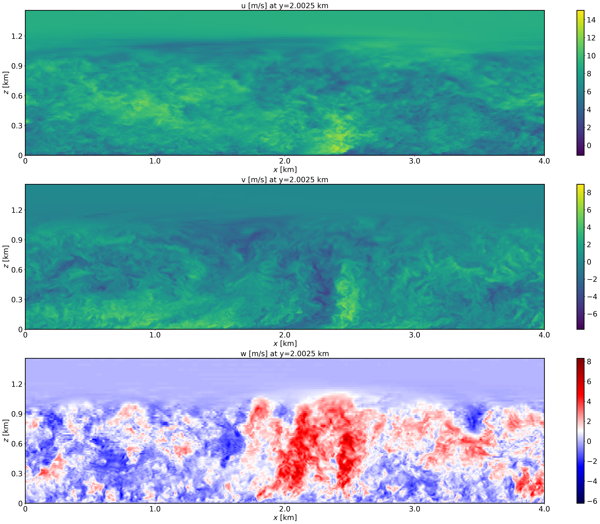
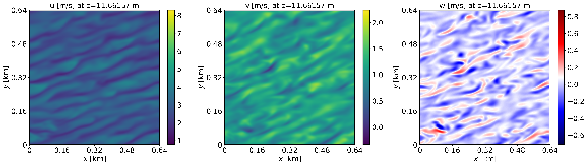
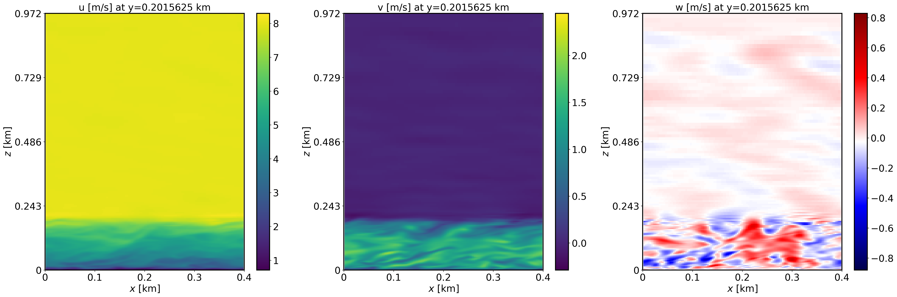
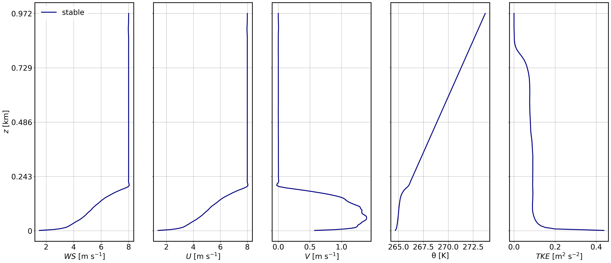

CASE 1: DRY NEUTRAL BOUNDARY LAYER
==================================

Background
----------

This is a canonical neutral boundary layer scenario described by Sauer and Munoz-Esparza (2020). A geostrophic wind is prescribed over ground with a set aerodynamic roughness length under a neutrally stratified boundary layer. The purpose of this test case is to visualize and analyze the resultant flow and turbulence characteristics that develop when the LES reaches statistical steady-state.

Input parameters
----------------

* Number of grid points: :math:`[N_x,N_y,N_z]=[800,800,122]`
* Isotropic grid spacings: :math:`[dx,dy,dz]=[5,5,5]`
* Domain size: :math:`[4 \times 4 \times 1.2]` km
* Model time step: 0.01 s
* Advection scheme: 3rd order QUICK
* Time scheme: 3rd order Runge Kutta
* Geostrophic wind: :math:`[U_g,V_g]=[10,0]` m/s
* Latitude: :math:`54.0^{\circ}` N
* Potential temperature gradients: The potential temperature is constant at 300 K from the surface to :math:`z= 500` m. Between :math:`500-650` m, the vertical gradient is :math:`0.08` K/m. Above :math:`650` m, the vertical gradient is :math:`0.003` K/m.
* Surface heat flux:  :math:`0.0` Km/s
* Surface roughness length: :math:`z_0=0.1` m
* Rayleigh damping layer: uppermost :math:`400` m of the domain
* Cell perturbations: :math:`\pm 0.25` K 
* Top boundary condition: free slip
* Lateral boundary conditions: periodic
* Time period: 2 h

Execute FastEddy
----------------

Here we will describe how to download the FastEddy package and run the model. The package will include the executables, a script to install the executables in a directory structure, and other files such as the Jupyter notebooks.

Visualize the output
--------------------

Open the Jupyter notebook entitled "FE-TUTORIAL-analyses.ipynb" and execute it. Please ensure you create the plots exactly as shown below.

XY-plane views of instantaneous velocity components at t=1.8 h (FE_TEST.648000).

  
XZ-plane views of instantaneous velocity components at t=1.8 h (FE_TEST.648000).

  
Mean profiles at t=1.8 h (FE_TEST.648000).

.. image:: notebooks/MEAN-PROF-neutral.png
  :width: 600
  :alt: Alternative text
  
Other plots TBD...

Analyze the output
------------------

* Using the XY and XZ cross sections, discuss the characteristics of the resolved turbulence.
* What is the boundary layer height in the neutral case?
* Using the vertical profile plots, explain why the boundary layer is neutral.
* Other...

CASE 2: DRY CONVECTIVE BOUNDARY LAYER
=====================================

This is the convective boundary layer scenario described by Sauer and Munoz-Esparza (2020). This case represents the boundary layer conditions at the SWiFT facility near Lubbock, Texas at 4 July 2012 during the period of 18Z-20Z (12:00–14:00 local time), the strongest period of convection on the day.

Input parameters
----------------

* Number of grid points: :math:`[N_x,N_y,N_z]=[600,600,122]`
* Isotropic grid spacings: :math:`[dx,dy,dz]=[10,10,10]`
* Domain size: :math:`[6 \times 6 \times 2.9]` km
* Model time step: 0.02 s
* Geostrophic wind: :math:`[U_g,V_g]=[8,0]` m/s
* Advection scheme: Hybrid 5th-6th order, blending coefficient of 0.8
* Time scheme: 3rd order Runge Kutta
* Latitude: :math:`33.5^{\circ}` N
* Potential temperature gradients: The potential temperature is constant at 309 K from the surface to :math:`z= 500` m. Above that the vertical gradient is :math:`0.004` K/m. 
* Surface heat flux:  :math:`0.35` Km/s
* Surface roughness length: :math:`z_0=0.05` m
* Rayleigh damping layer: uppermost :math:`600` m of the domain
* Cell perturbations: :math:`\pm 0.25` K 
* Top boundary condition: free slip
* Lateral boundary conditions: periodic
* Time period: 6 h

Execute FastEddy
----------------

Here we will describe how to download the FastEddy package and run the model. The package will include the executables, a script to install the executables in a directory structure, and other files such as the Jupyter notebooks.

Visualize the output
--------------------

Open the Jupyter notebook entitled "FE-TUTORIAL-analyses.ipynb" and execute it. Please ensure you create the plots exactly as shown below.

XY-plane views of instantaneous velocity components at t=5.26 h (FE_TEST.948000).

  
XZ-plane views of instantaneous velocity components at t=5.26 h (FE_TEST.948000).

  
Mean profiles at t=5.26 h (FE_TEST.948000).

.. image:: notebooks/MEAN-PROF-convective.png
  :width: 600
  :alt: Alternative text

Analyze the output
------------------

* Using the XY and XZ cross sections, discuss the characteristics of the resolved turbulence.
* What is the boundary layer height in the convective case?
* Using the vertical profile plots, explain why the boundary layer is unstable.
* Other...

CASE 3: DRY STABLE BOUNDARY LAYER
=================================

Background
------------------

This is the stable boundary layer scenario described by Sauer and Munoz-Esparza (2020). This the stable boundary layer scenario outlined in Kosovic and Curry (2000).

Input parameters
----------------

* Number of grid points: :math:`[N_x,N_y,N_z]=[128,128,122]`
* Isotropic grid spacings: :math:`[dx,dy,dz]=[3.125,3.125,3.125]`
* Domain size: :math:`[0.4 \times 0.4 \times 0.4]` km
* Model time step: 0.005 s
* Geostrophic wind: :math:`[U_g,V_g]=[9,0]` m/s
* Advection scheme: Hybrid 5th-6th order, blending coefficient of 0.8
* Time scheme: 3rd order Runge Kutta
* Latitude: :math:`72.5^{\circ}` N
* Potential temperature gradients: The potential temperature is constant at 265 K from the surface to :math:`z= 100` m. Above that the vertical gradient is :math:`0.01` K/m. 
* Surface heat flux:  :math:`-0.25` K/h
* Surface roughness length: :math:`z_0=0.05` m
* Rayleigh damping layer: uppermost :math:`100` m of the domain
* Cell perturbations: :math:`\pm 0.25` K 
* Top boundary condition: free slip
* Lateral boundary conditions: periodic
* Time period: 2 h

Execute FastEddy
----------------

Here we will describe how to download the FastEddy package and run the model. The package will include the executables, a script to install the executables in a directory structure, and other files such as the Jupyter notebooks.

Visualize the output
--------------------

Open the Jupyter notebook entitled "FE-TUTORIAL-analyses.ipynb" and execute it. Please ensure you create the plots exactly as shown below.

XY-plane views of instantaneous velocity components at t=2 h (FE_TEST.1440000).

  
XZ-plane views of instantaneous velocity components at t=2 h (FE_TEST.1440000).

  
Mean profiles at t=2 h (FE_TEST.1440000).

Analyze the output
------------------

* Using the XY and XZ cross sections, discuss the characteristics of the resolved turbulence.
* What is the boundary layer height in the stable case?
* Using the vertical profile plots, explain why the boundary layer is stable.
* Other...

CASE 4: MOIST CONVECTIVE CASE
==============================

Background
------------------

Here, we will run the FastEddy with explicit microphysics in a convectively unstable troposphere. Parameters TBD.

OVERARCHING QUESTIONS
=====================

* What are main differences in the scale and magnitude of the resolved turbulence among the three cases?
* How do the boundary layer heights differ among the cases? Why?
* How does the TKE vary among the three cases? Which case has the highest TKE and why?
* Other...

SENSITIVITY TESTS
=================

(Here, the user will make some modifications to the default parameters such as changing the grid spacing, stretching, model time step, advection scheme, number of grid points, domain decomposition and number of GPUs, etc, etc. Here, the user will execute the sensitivity test, and visualize and analyze the output)

* Re-run the neutral case with :math:`[N_x,N_y,N_z]=[400,400,122]` and isotropic grid spacings of: :math:`[dx,dy,dz]=[10,10,10]`. Adjust the model time step accordingly. Re-make all plots and discuss the differences between the control case. How much faster was the simulation completed? 
* Re-run the convective case with a surface heat flux of :math:`0.70` Km/s. Re-make all plots and discuss the differences between the control case.
* Re-run the neutral case with :math:`z_0=0.3` m. Re-make all plots and discuss the differences between the control case.
* Re-run the neutral case with the first order upwind advection scheme. Re-make all plots and discuss the differences between the control case. Why is the first order scheme a bad choice?
* Re-run the stable case with a surface cooling rate of :math:`-0.5` K/h. Re-make all plots and discuss the differences between the control case.
* Re-run the stable case using 4 GPUs instead of the control simulation's 8 GPUs. How much slower does the case run?

EXTRA 
======

:math:`x^2+y^2=z^2`

.. math::

   \frac{ \sum_{t=0}^{N}f(t,k) }{N}

